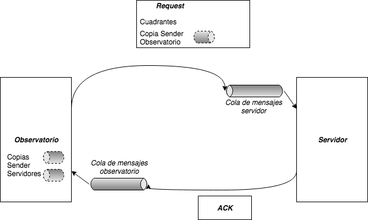

# Segundo Proyecto: ConcuStar

### Alumnos

|**Nombre**|**Padrón**|
|:---|:---|
|*Adrián Barral*|95137|
|*Bruno Liberini*|90899|

## Procesos

El programa se divide en dos familias de *threads*: los threads *Client*, que representan a los observatorios, y los threads *Server*, que representan a los servidores que procesan las imágenes.

### Threads *Client* u Observatorios

Los threads *Client* representan a los observatorios obteniendo imágenes. Luego de leer el número de observatorios y cada configuración (que incluye velocidad de captura de imágenes y la distribución de cuadrantes a cada servidor), el programa crea un nuevo thread por cada observatorio y ejecuta en él su método `run()`. Este método contiene la lógica de negocio del observatorio.

Al crearse un objeto de tipo *Client*, su constructor genera por cada uno de los servidores un objeto de tipo *VirtualLink*, que contiene un `Sender` de una cola de mensajes de Rust que comunica con ese servidor. También se crea un objeto de tipo *Host*, que es un wrapper sobre la API de colas de mensaje (*channels*) de Rust. Esta cola de mensaje permitirá la comunicación desde cada servidor al observatorio.

El método `run()` ejecuta en loop infinito las siguientes instrucciones:

* Por cada servidor, distribuye tantos cuadrantes de la imagen capturada como se haya configurado considerando la velocidad de captura de imágenes del observatorio y envía a este por el *VirtualLink* correspondiente.
* Espera la respuesta de todos los servidores con los cuadrantes procesados.
* Duerme el thread en una cantidad de tiempo.

### Threads *Server* o Servidores

Los threads *Server* representan los servidores que procesan las imágenes. Luego de leer el número de servidores y su poder de procesamiento de la configuración, el programa crea un nuevo thread por cada servidor y ejecuta en él su método `run()`. Este método contiene la lógica de negocio del servidor.

Al crearse un objeto de tipo *Server*, su constructor genera un objeto de tipo *Host*. El `Sender` de esta cola de mensajes se clonará por cada observatorio cuando se cree uno y permitirá que el observatorio se comunique con él.

El método `run()` ejecuta en loop infinito las siguientes instrucciones:

* Espera la recepción de un mensaje en su cola de mensaje.
* Cuando recibe un mensaje de tipo *Packet*:
  * Calcula el tiempo de procesamiento de la cantidad de cuadrantes enviado.
  * Duerme el thread el tiempo equivalente al tiempo de procesamiento (simulándolo).
  * Guarda la estadística de cuánto tiempo tomó procesar el workload del observatorio, o actualiza el tiempo promedio si ya se contaba con estadísticas para él.
  * Informa al observatorio de su procesamiento a través del `Sender` que tiene el *Packet*, que comunica con una cola de mensajes que recibe el observatorio.

## Esquema y Protocolo de comunicación



Para poder comunicar *Clients* (observatorios) y *Servers* (servidores) se hace uso de dos juegos de colas de mensaje. Por un lado, una cola de mensaje por cada servidor, que permite a los observatorios enviar los cuadrantes a procesar a cada servidor. Y por otro, una cola de mensaje por cada observatorio, que permite a los servidores enviar la notificación al observatorio informando que terminó de procesar los cuadrantes correspondientes. Cada cola de mensaje se crea cuando se instancia un objeto de cada clase.

Para obtener acceso al `Sender` del channel de cada servidor, la clase observatorio recorre la colección de servidores creados y clona la referencia al `Sender` de cada channel en un atributo de instancia del observatorio. Cuando el observatorio toma muestras y las divide en cuadrantes, recorre esta colección de `Senders` enviando la cantidad de cuadrantes correspondientes a cada servidor según su configuración.

Para permitir que el servidor notifique al observatorio que terminó de procesar los cuadrantes, cada mensaje de tipo *Packet* tiene, aparte del *workload* (que simboliza los cuadrantes a procesar), una referencia clonada al `Sender` del channel del observatorio. Cuando el servidor termina de procesar, utiliza esta referencia para enviar un mensaje de notificación al observatorio, que espera que cada servidor envíe para procesar la siguiente imagen.

## Codificación

### configuration.rs

```
use std::collections::HashMap;
use std::fs::File;
use std::io::{BufRead, BufReader};

/*==============================================================================
 * Server data
 *
 */

pub struct ServerData {
  processing_power: u64
}

impl ServerData {

  pub fn get_processing_power(&self) -> u64 {
    self.processing_power
  }

}

/*==============================================================================
 * Client data
 *
 */

pub struct ClientData {
  work_generation_rate: u64,
  workshare: Vec<f64>
}

impl ClientData {

  pub fn get_workshare(&self) -> &Vec<f64> {
    &self.workshare
  }

  pub fn get_work_generation_rate(&self) -> u64 {
    self.work_generation_rate
  }

}

/*==============================================================================
 * Configuration
 *
 */

const DEFAULT: &str = "1";

pub struct Configuration{
  pub data: HashMap<String, String>,
}

impl Configuration {

  pub fn new() -> Configuration{
    Configuration{
      data: HashMap::new()
    }
  }

  pub fn load(&mut self) {
    // Copiamos el archivo config al directorio del ejecutable
    let f = File::open("config");
    let _f = match f {
      Ok(file) => {
        for line in BufReader::new(file).lines() {
          let new_line = line.unwrap();
          let vec: Vec<&str> = new_line.split("=").collect();
          self.data.insert(vec[0].to_string(), vec[1].to_string());
        }
      },
      Err(_err) => {
        println!("Error al cargar archivo");
      },
    };
  }

  pub fn get(&self, key: &str) -> &str {
    if !self.data.contains_key(key) {
      DEFAULT
    } else {
      self.data.get(key).unwrap()
    }
  }

  pub fn get_server_dataset(&self) -> Vec<ServerData> {
    let mut dataset = Vec::new();

    /*
     * Para configurar n servidores definimos la variable S:
     *
     *   S = p1;p2;p3;...;pn
     *
     * ... donde pk es el poder de procesamiento (u64), en cuadrantes por
     * unidad de tiempo, del k-ésimo servidor.
     *
     */

    let raw_data = self.get("S");
    let raw_dataset = raw_data.split(';');

    for p in raw_dataset {
      dataset.push(ServerData {
        processing_power: p.parse::<u64>().unwrap()
      });
    }

    return dataset;
  }

  pub fn get_client_dataset(&self) -> Vec<ClientData> {
    let mut dataset = Vec::new();

    /*
     * Para configurar m clientes definimos la variable C:
     *
     *   C=x1,p11,p12,...,p1n;x2,p21,p22,...,p2n;...;xm,pm1,pm2,...,pmn
     *
     * donde xj es la cantidad de cuadrantes a procesar generados por unidad
     * de tiempo por el j-ésimo cliente, y pjk es la fracción de trabajo que
     * el j-ésimo cliente envía al k-ésimo servidor.
     *
     */

    let raw_data = self.get("C");
    let raw_dataset = raw_data.split(';');

    for raw_client_data in raw_dataset {
      let mut workshare = Vec::new();

      // Tomamos los elementos de la tupla.
      let raw = raw_client_data.split(',').collect::<Vec<&str>>();

      // Parseamos la tasa de generación de trabajo.
      let work_generation_rate: u64 = raw[0].parse::<u64>().unwrap();

      // Parseamos la distribución de trabajo.
      for i in 1..raw.len() {
        workshare.push(raw[i].parse::<f64>().unwrap());
      }

      dataset.push(ClientData {
        work_generation_rate: work_generation_rate,
        workshare: workshare
      });
    }

    return dataset;
  }

}
```

### main.rs

```
#[macro_use]
extern crate log;
extern crate fern;
/*
extern crate log;
extern crate env_logger;
*/
extern crate chrono;
extern crate libc;

mod configuration;
use configuration::ServerData;
use configuration::ClientData;
/*
use log::{Record, Level, Metadata, LevelFilter};
use env_logger::{Builder};
*/

use std::sync::mpsc;
use std::thread;
use std::time;
use std::env;

/*==============================================================================
 * Loggers
 *------------------------------------------------------------------------------
 *
 */

fn setup_terminal_logging() -> Result<(), fern::InitError> {
  fern::Dispatch::new()
      .format(|out, message, record| unsafe {
        out.finish(format_args!(
          "{}[{}] {}",
          chrono::Local::now().format("[%Y-%m-%d][%H:%M:%S]"),
          libc::pthread_self(),
          message
        ))
      })
      .level(log::LevelFilter::Info)
      .chain(std::io::stdout())
      .apply()?;
  Ok(())
}

fn setup_file_logging() -> Result<(), fern::InitError> {
  fern::Dispatch::new()
      .format(|out, message, record| unsafe {
        out.finish(format_args!(
          "{}[{}] {}",
          chrono::Local::now().format("[%Y-%m-%d][%H:%M:%S]"),
          libc::pthread_self(),
          message
        ))
      })
      .level(log::LevelFilter::Info)
      .chain(fern::log_file("output.log")?)
      .apply()?;
  Ok(())
}

/*==============================================================================
 * Packet
 *------------------------------------------------------------------------------
 *
 */

struct Packet {
  from: VirtualLink,
  workload: u64,
  origin: u32,
}

impl Packet {

  fn from_iface(iface: &NetworkInterface, workload: u64, origin: u32) -> Packet {
    Packet {
      from: (*iface).get_virtual_link(),
      workload: workload,
      origin: origin,
    }
  }

  fn answer_me_at(tx: &mpsc::Sender<Packet>, workload: u64, origin: u32) -> Packet {
    Packet {
      from: VirtualLink::linked_to(tx),
      workload: workload,
      origin: origin,
    }
  }

}

/*==============================================================================
 * VirtualLink
 *------------------------------------------------------------------------------
 *
 */

struct VirtualLink {
  s: mpsc::Sender<Packet>
}

impl VirtualLink {

  fn to_iface(interface: &NetworkInterface) -> VirtualLink {
    VirtualLink {
      s: (*interface).s.clone()
    }
  }

  fn linked_to(tx: &mpsc::Sender<Packet>) -> VirtualLink {
    VirtualLink {
      s: (*tx).clone()
    }
  }

  fn send_through(&self, packet: Packet) {
    self.s.send(packet).unwrap()
  }

}

/*==============================================================================
 * Network Interface
 *------------------------------------------------------------------------------
 *
 */

struct NetworkInterface {
  s: mpsc::Sender<Packet>,
  r: mpsc::Receiver<Packet>
}

impl NetworkInterface {

  fn new() -> NetworkInterface {
    let (tx, rx) = mpsc::channel();

    NetworkInterface {
      s: tx,
      r: rx
    }
  }

  fn read(&self) -> Packet {
    self.r.recv().unwrap()
  }

  fn get_virtual_link(&self) -> VirtualLink {
    VirtualLink::to_iface(self)
  }

}

/*==============================================================================
 * Host
 *
 */

 struct Host {
   nic: NetworkInterface,
 }

 impl Host {

   fn new() -> Host {
     Host {
       nic: NetworkInterface::new(),
     }
   }

   fn get_virtual_link(&self) -> VirtualLink {
     self.nic.get_virtual_link()
   }

 }

/*==============================================================================
 * Server
 *
 */

struct Server {
  id: u32,
  host: Host,
  processing_power: u64
}

impl Server {

  fn new(id: u32, server_data: ServerData) -> Server {
    Server {
      id: id,
      host: Host::new(),
      processing_power: server_data.get_processing_power()
    }
  }

  fn get_virtual_link(&self) -> VirtualLink {
    self.host.get_virtual_link()
  }

  fn run(self) {
    info!("[S{}] Ejecutando servidor {}", self.id, self.id);

    let rx = self.host.nic.r;
    let tx = self.host.nic.s;

    for message in rx {

       // Obtenemos la cantidad de cuadrantes a procesar.
       let workload = message.workload;

       info!("[S{}] Recibidas {} unidades de trabajo desde observatorio {}", self.id, workload, message.origin);

       /*
        * Procesamos los cuadrantes.
        *
        * El workload tiene unidades de trabajo. El poder de procesamiento
        * tiene unidades de trabajo por segundo. El sleep time tiene unidades
        * de milisegundos.
        *
        * Por ejemplo, un servidor recibe 5 unidades de trabajo desde el
        * cliente. El servidor puede procesar dos unidades de trabajo por
        * segundo. El hilo dormirá entonces 2500 milisegundos simulando
        * el procesamiento de la carga. Para acelerar o relentizar
        * la simulación, podemos ajustar el factor global de velocidad;
        * por ejemplo, si el factor global es 2.0, en vez de dormir los 2500
        * milisegundos dormiría 1250.
        *
        */
       let sleep_time = (1000*workload)/self.processing_power;
       let sleep_time_scaled = ((sleep_time as f64)/GLOBAL_SPEED) as u64;

       info!("[S{}] Tiempo estimado: {}ms (s: {}ms)", self.id, sleep_time, sleep_time_scaled);
       thread::sleep(time::Duration::from_millis(sleep_time_scaled));

       info!("[S{}] Procesamiento terminado; devolviendo ACK a observatorio {}", self.id, message.origin);

       // Devolvemos el ACK.
       let response = Packet::answer_me_at(&tx, 0, self.id);
       message.from.send_through(response);
    }
  }

}

/*==============================================================================
 * Client
 *
 */

struct Target {
  virtual_link: VirtualLink,
  weight: f64
}

struct Client {
  id: u32,
  host: Host,
  distribution_scheme: Vec<Target>,
  work_generation_rate: u64
}

impl Client {

  fn new(id: u32, servers: &Vec<Server>, client_data: ClientData) -> Client {
    let workshare: &Vec<f64> = client_data.get_workshare();
    let mut distribution = Vec::new();

    for i in 0..servers.len() {
      distribution.push(Target {
        virtual_link: servers[i].get_virtual_link(),
        weight: workshare[i]
      });
    }

    Client {
      id: id,
      host: Host::new(),
      distribution_scheme: distribution,
      work_generation_rate: client_data.get_work_generation_rate()
    }
  }

  fn run(self) {
    info!("[C{}] Ejecutando cliente {}", self.id, self.id);

    /*
     * Cada cierta cantidad de tiempo, el observatorio genera x cuadrantes.
     * A partir de ahí itera por la lista de servidores distribuyendo los
     * cuadrantes según los factores de distribución (e.g., si debe enviar
     * una fracción p_k de los cuadrantes al servidor k, enviará p_k*x
     * cuadrantes al servidor k).
     *
     * Habiendo enviado los mensajes, simplemente espera las respuestas.
     * Suponiendo alternativamente que hay que seguir generando cuadrantes
     * mientras se toman fotos, se pueden tener internamente dos threads,
     * uno acumulando cuadrantes y otro tomando cuadrantes y distribuyendolos.
     *
     * Para medir el tiempo de respuesta del observatorio se puede ir
     * calculando una media móvil, tomando el tiempo que tarda en responder
     * cada servidor.
     */

    let targets = &self.distribution_scheme;

    loop {
      let x = self.work_generation_rate;

      info!("[C{}] Generando {} unidades de trabajo", self.id, x);

      // Distribuimos los x cuadrantes generados.
      let mut sid = 0;

      for target in targets {
        sid += 1;

        let workload = ((x as f64)*(target.weight)) as u64;
        let packet = Packet::from_iface(&self.host.nic, workload, self.id);

        info!("[C{}] Enviando {} unidades al servidor {}", self.id, workload, sid);
        target.virtual_link.send_through(packet);
      }

      // Esperamos la respuesta de cada servidor.
      info!("[C{}] Esperando respuestas", self.id);
      for _d in targets {
        let _response = self.host.nic.read();
      }

      info!("[C{}] Todos los servidores terminaron de procesar el bache", self.id);

      /* TODO: Ajustar para dormir hasta completar una cierta cantidad;
       * el tiempo a dormir dependerá del tiempo de respuesta.
       *
       */
      let sleep_time = (3000.0/GLOBAL_SPEED) as u64;
      thread::sleep(time::Duration::from_millis(sleep_time));

    }
  }

}

/*==============================================================================
 * Main
 *
 */

const GLOBAL_SPEED: f64 = 1.0;

fn main() {

  let args : Vec<String> = env::args().collect();

  if args.len() > 1 && args[1] == "--debug" {
    setup_file_logging().expect("Couldn't set up logger");
  } else {
    setup_terminal_logging().expect("Couldn't set up logger");
  }
  /*
   * Cargamos la configuración. La configuración es un archivo de texto con
   * pares clave-valor. El objeto de configuración puede usarse como
   *
   *     configuration.get("clave") // retorna el valor asociado a "clave".
   */

  info!("[T0] Cargando configuración");
  let mut configuration = configuration::Configuration::new();
  configuration.load();

  let mut threads = Vec::new();
  let mut servers: Vec<Server> = Vec::new();
  let mut clients: Vec<Client> = Vec::new();

  info!("[T0] Inicializando servidores");
  let server_data: Vec<ServerData> = configuration.get_server_dataset();
  let mut server_count = 0;

  for d in server_data {
    server_count += 1;
    servers.push(Server::new(server_count, d));
  }

  info!("[T0] Inicializando clientes");
  let client_data: Vec<ClientData> = configuration.get_client_dataset();
  let mut client_count = 0;

  for c in client_data {
    client_count += 1;
    clients.push(Client::new(client_count, &servers, c));
  }

  info!("[T0] Lanzando hilos servidores");
  for server in servers {
    let th = thread::spawn(move || {
      server.run();
    });
    threads.push(th);
  }

  info!("[T0] Lanzando hilos clientes");
  for client in clients {
    let th = thread::spawn(move || {
      client.run();
    });
    threads.push(th);
  }

  info!("[T0] Esperando la finalización del programa");
  for th in threads {
    th.join().unwrap();
  }

}
```
